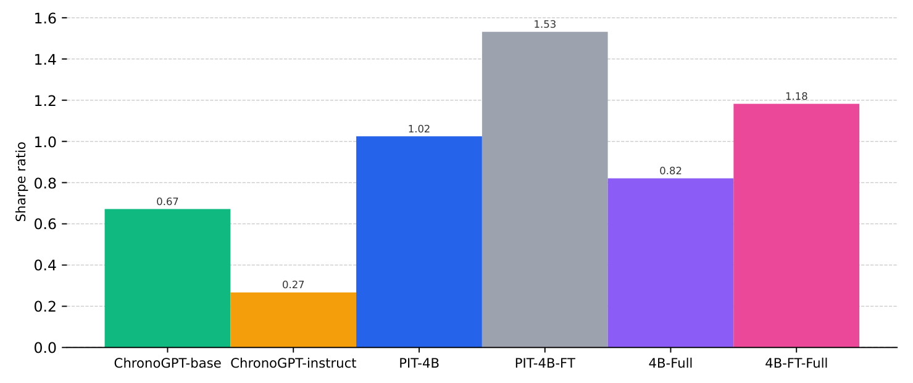

<h1 align="center">Scaling Point-in-Time Language Models</h1>

<p align="center">
  <a href="https://arxiv.org/abs/2607.11889"></a>
  <a href="https://huggingface.co/Diamegs"></a>
  <a href="LICENSE"></a>
</p>

<p align="center">
  Code for <i>Scaling Point-in-Time Language Models: Enabling Economic Evaluation of Embeddings</i><br>
  Semyon Malamud, Bryan Kelly, Johannes Schwab, Teng Andrea Xu
</p>

Language models trained on today's internet already know what happened tomorrow. That **look-ahead bias** invalidates backtests and causal inference in finance and the social sciences.
**Point-in-time (PIT)** models only ever see text published up to a given date, so they are free of this leakage by construction.

We show that point-in-time training does not have to mean weak models:

- **Yearly checkpoints, 2013 to 2024.** GPT-style models are trained year by year on chronologically ordered FineWeb data. We release one checkpoint per year, and each has only seen text up to the end of its year.
- **Scaled up.** PIT-1B (1.5B parameters, 170B tokens) and PIT-4B (4B parameters, 1T tokens), plus the instruction-tuned PIT-4B-FT.
- **Economically useful.** Embeddings from PIT models build profitable, fully tradable portfolios from news without any look-ahead.
- **Fully open.** Dataset construction, pre-training, instruction tuning, evaluation and the portfolio experiments are all in this repository.

## Point-in-time training doesn't kill model performance

Zero-shot accuracy (%) on common sense reasoning benchmarks. PIT-4B is the strongest point-in-time model by a wide margin and comes close to Gemma-3-4B and LLaMA-7B, which are trained **without** any time restriction.

| Model | BoolQ | PIQA | HellaSwag | WinoGrande | ARC-e | ARC-c | OBQA | Avg. |
|---|:---:|:---:|:---:|:---:|:---:|:---:|:---:|:---:|
| *Point-in-time (data up to 2024)* | | | | | | | | |
| ChronoGPT_2024 | 60.4 | 66.5 | 43.9 | 54.9 | 52.5 | 29.5 | 34.8 | 48.9 |
| DatedGPT_2024 | – | 70.5 | 53.2 | – | 52.0 | 34.7 | – | 52.6 |
| **PIT-1B_2024 (ours)** | 61.9 | 76.1 | 64.3 | 59.4 | 49.5 | 30.4 | 34.8 | 53.8 |
| **PIT-4B_2024 (ours)** | **63.0** | **78.9** | **72.2** | **64.2** | **54.4** | **35.1** | **39.0** | **58.1** |
| *No time restriction* | | | | | | | | |
| Gemma-3-1B | 66.4 | 74.8 | 62.0 | 58.9 | 72.2 | 38.3 | 37.0 | 58.5 |
| Gemma-3-4B | 79.0 | 80.0 | 76.0 | 69.5 | 81.8 | 54.9 | 43.0 | 69.2 |
| LLaMA-7B | 76.8 | 79.7 | 76.0 | 69.6 | 72.1 | 44.3 | 44.4 | 66.1 |

DatedGPT numbers are taken from the original paper (its weights were not available).

## Point-in-time embeddings have economic value

We embed Dow Jones Newswire articles with the checkpoint that was valid on each article's date, sort stocks into portfolios by embedding coordinate, and combine them with a Maximum Sharpe Ratio Regression. The figure shows the out-of-sample annualized Sharpe ratios.

<p align="center"></p>

PIT-4B and PIT-4B-FT reach Sharpe ratios of 1.02 and 1.53, well above the smaller ChronoGPT models. They even outperform **4B-Full** and **4B-FT-Full**, which use the final checkpoint for every month and therefore *do* have look-ahead bias.

## Models

Checkpoints are on Hugging Face at **[huggingface.co/Diamegs](https://huggingface.co/Diamegs)**: PIT-1B, PIT-4B and PIT-4B-FT, one snapshot per year from 2013 to 2024 (for example `Diamegs/PIT-4B-201912`).

## Changelog

**2026-10-01: within-year checkpoints no longer leak next-month data**

- **The problem.** In the previous version of the training code, within-year (monthly) checkpoints could contain a small amount of data from the following month. Each one was saved only after an optimizer step that already included the first batches of the next month, and some GPUs could move on to the next month before the others.
- **Released models are not affected.** We trained one year at a time, and each run only contained that year's shards, so the year-end checkpoints never saw data from the following year. The released models are all year-end checkpoints. The within-year checkpoints were never shared.
- **The fix.** All GPUs now switch to the next month at the same time, and each monthly checkpoint is saved before any GPU reads the next month's data. The changes are in `dataloaders/DDP.py` and `train_gpt.py`. **Use this version for point-in-time training.**

## Installation

Requires Python 3.11 or newer.

```bash
pip install -r requirements.txt
pip install -e .
```

Training and evaluation need NVIDIA GPUs. The hyperparameter presets are in [training/Hyperparams.py](training/Hyperparams.py).

## Reproducing the pipeline

```
FineWeb ──► monthly shards ──► pre-training ──► monthly checkpoints ──┬──► benchmarks
                                                                      ├──► SFT (LoRA) ──► IFEval
                                                                      └──► news embeddings ──► portfolios
```

### 1. Data

Build the monthly pre-training shards (`<YYYY-MM>.bin`) and download the validation shard:

```bash
cd data && python get_train_set.py --all --output-dir <TRAIN_SHARDS_DIR> && cd ..
python data/get_validation_set.py <VAL_SHARDS_DIR>
```

Build the instruction-tuning data. This keeps only "timeless" examples, filtered by an LLM classifier, so it needs `OPENAI_API_KEY`:

```bash
bash post_training/store_tokens.sh
```

### 2. Pre-training

Training runs one year at a time. Each run reads only that year's shards, in chronological order, and the next year resumes from the previous year-end checkpoint. Within a run, a checkpoint `<YYYY-MM>_step=<N>_checkpoint.pt` is saved in `checkpoints/` as soon as a month ends, before any data from the next month is seen.

```bash
# First year
torchrun --nproc_per_node=$NGPUS train_gpt.py --model <1B|4B> \
    --data-dir "<TRAIN_SHARDS_DIR>/2013-*.bin" \
    --val-dir "<VAL_SHARDS_DIR>/fineweb_val_*.bin" \
    --total-tokens <TOTAL_TOKENS>

# Each following year resumes from the previous year-end checkpoint
torchrun --nproc_per_node=$NGPUS train_gpt.py --model <1B|4B> \
    --data-dir "<TRAIN_SHARDS_DIR>/2014-*.bin" \
    --val-dir "<VAL_SHARDS_DIR>/fineweb_val_*.bin" \
    --total-tokens <TOTAL_TOKENS> \
    --resume checkpoints/2013-12_step=<N>_checkpoint.pt
```

- `--data-dir` and `--val-dir` are glob patterns, so keep the quotes.
- `<TOTAL_TOKENS>` is the number of tokens in all the shards you train on, over all years. `python data/verify_8B_tokens.py --dir <TRAIN_SHARDS_DIR>` lists the count for each shard.
- Pass the same `<TOTAL_TOKENS>` to every yearly run, so that one learning-rate schedule spans the whole corpus. Without it, each run gets its own schedule that decays to zero.
- `--config` selects a preset from [training/Hyperparams.py](training/Hyperparams.py). The default is `CSCS_160GPU_2K`.

### 3. Instruction tuning and IFEval

LoRA fine-tuning of each 4B checkpoint. For each checkpoint, the script runs IFEval, fine-tunes, merges the adapter into `model-sft/<name>_merged.pt` and runs IFEval again. The IFEval summaries are written to `ifeval_outputs_new/`.

```bash
bash post_training/sft_all.sh <CHECKPOINT_1.pt> [CHECKPOINT_2.pt] ...
```

IFEval for the baselines, and the IFEval plot:

```bash
torchrun --nproc_per_node=1 eval/ifeval_test.py --candidate manelalab/chrono-gpt-instruct-v1-20241231
torchrun --nproc_per_node=1 eval/ifeval_test.py --candidate Qwen/Qwen1.5-1.8B-Chat
python results/plotting/plot_ifeval_histogram.py "<LABEL>=ifeval_outputs_new/<name>_summary.txt" ...
```

### 4. Benchmarks

Zero-shot common sense reasoning for the PIT checkpoints, ChronoGPT and Hugging Face models. Each command writes one CSV per model to `results/`. `eval_multigpu.py` runs on a single GPU.

```bash
python3 eval/eval_multigpu.py --model <1B|4B> --checkpoints <CHECKPOINT_1.pt> [CHECKPOINT_2.pt] ...
python3 eval/eval_chrono.py --repo-id manelalab/chrono-gpt-v1-20241231
python3 eval/eval_hf_models.py --models google/gemma-3-1b-pt google/gemma-3-4b-pt huggyllama/llama-7b
```

Then build the LaTeX table. `<CSV_NAME>` is the name of a file in `results/` without `.csv`.

```bash
python results/generate_latex_table.py --pit-4b <CSV_NAME> [--pit-1b <CSV_NAME>] > table.tex
```

### 5. Embeddings and portfolios

Copy the settings template, then fill in the paths to the news files, the checkpoints, the return panel and the output directory:

```bash
cp embeddings/experiments/.env.example embeddings/experiments/.env
```

Embed the news articles with each model. Submit the SLURM jobs from the repository root; their logs go to `logs/`. Each job writes `$EMBEDDINGS_DIR/<model>/embeddings_monthly.pkl`. The `submit_full.sh` jobs use the final checkpoint for every month, so they are not point-in-time.

```bash
mkdir -p logs
sbatch embeddings/experiments/4b/submit.sh                                       # PIT-4B
sbatch embeddings/experiments/4b-ft/submit.sh                                    # PIT-4B-FT
sbatch embeddings/experiments/4b/submit_full.sh                                  # 4B-Full
sbatch embeddings/experiments/4b-ft/submit_full.sh                               # 4B-FT-Full
sbatch embeddings/experiments/chronoGPT/submit.sh                                # ChronoGPT-instruct
sbatch --export=ALL,MODEL_TYPE=base embeddings/experiments/chronoGPT/submit.sh   # ChronoGPT-base
```

- To run the jobs in a virtual environment, export `VENV=/path/to/venv` before calling `sbatch`.
- Adjust the `#SBATCH` partition and resources for your cluster.
- Without SLURM, run the scripts directly, e.g. `python embeddings/experiments/4b/main.py [--last_ckpt]`.

Then build the portfolios and compute the Sharpe ratios. The results go to `embeddings/experiments/results/`.

```bash
python embeddings/experiments/run_experiment.py
```

The Dow Jones Newswire and return data are licensed and not included.

## Repository layout

| Path | Contents |
|---|---|
| [data/](data/) | Monthly FineWeb shards, validation shard, Common Crawl dump-to-month coverage |
| [train_gpt.py](train_gpt.py) | Pre-training entry point |
| [models/](models/) | GPT model and size presets, lm-eval wrapper, ChronoGPT baseline |
| [optimizers/](optimizers/) | Muon optimizer and learning-rate schedule |
| [dataloaders/](dataloaders/), [training/](training/) | Distributed data loading, hyperparameters, checkpointing |
| [post_training/](post_training/) | Timeless SFT data, LoRA fine-tuning and merging |
| [eval/](eval/) | Common sense reasoning benchmarks and IFEval |
| [embeddings/experiments/](embeddings/experiments/) | News embeddings and portfolio experiments |
| [results/](results/) | Scripts for the paper's table and plots |

## Citation

If you use this code or the models, please cite:

```bibtex
@article{malamud2026scaling,
  title         = {Scaling Point-in-Time Language Models: Enabling Economic Evaluation of Embeddings},
  author        = {Malamud, Semyon and Kelly, Bryan and Schwab, Johannes and Xu, Teng Andrea},
  journal       = {arXiv preprint arXiv:2607.11889},
  year          = {2026},
  eprint        = {2607.11889},
  archivePrefix = {arXiv},
  primaryClass  = {cs.CL},
  url           = {https://arxiv.org/abs/2607.11889}
}
```

## License

Released under the [MIT License](LICENSE). Parts of the code are adapted from modded-nanogpt, llm.c and ChronoGPT, which are also MIT licensed; see [THIRD_PARTY_NOTICES.md](THIRD_PARTY_NOTICES.md).
